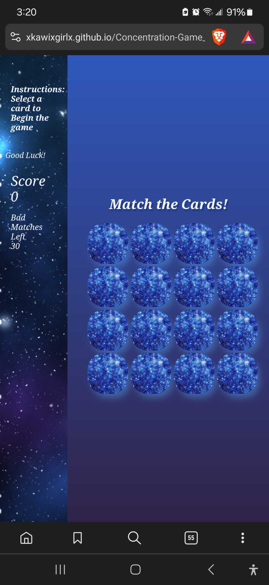
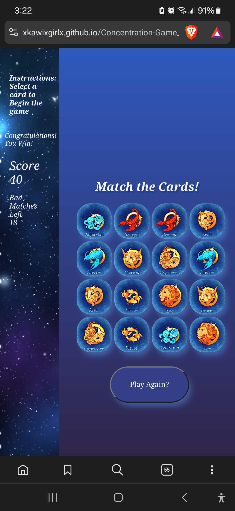

# <Zodiac Concentration - Match the Cards!>

This is a game of matching cards, using a space/galaxy/zodiac theme. The goal is to match all the cards, if you fail to match the cards in the limited amount of moves you lose! This is the first browser game I have created. The sidebar image and the favicons were made by me. 

# Screenshots

Included are images of the game, this first one is on a live Mobile Device, the other 3 are a fullscreen version on a desktop. The code as been made in a way that the game can be played on various devices not just desktop. 

# Technologies Used

- JavaScript
- HTML
- CSS
- CardStarter CSS Library
- Adobe Illustrator
- Adobe Photoshop
- Favicon Generator

# Getting Started

[Click to View Project Planning!](https://github.com/xkawixgirlx/Concentration-Game_1/tree/main/Planning/Project_1%20Inspo)
[Click to Play Zodiac Concentration!](https://xkawixgirlx.github.io/Concentration-Game_1/)

# Next Steps

- Add Audio in the background
- Add Modes: Zen Mode(Endless until a button is clicked), Hard Mode (less tries)
- Add Timer feature (possibly just for hard mode)